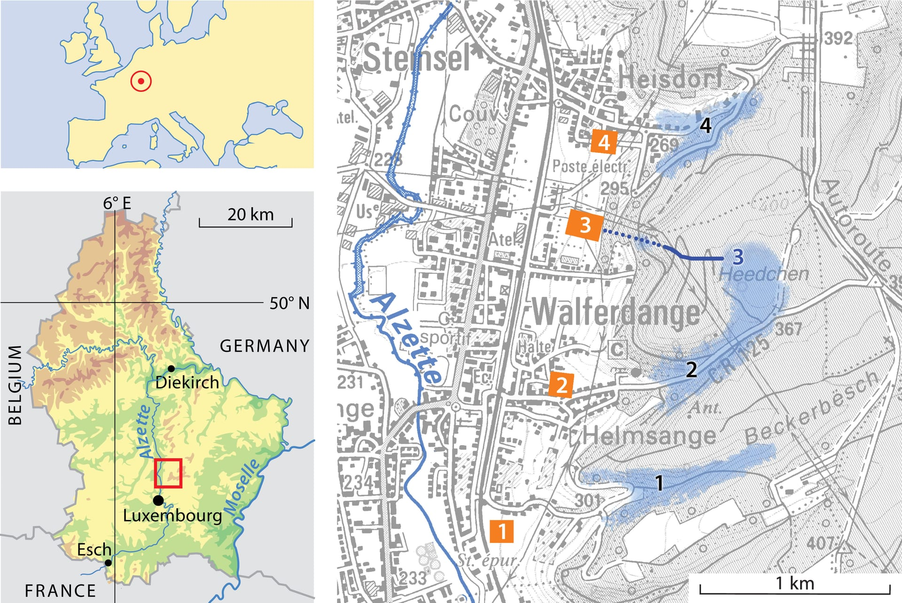

# Raschpëtzer Wiki

## Structure

- `originals/` — the source figure images (full-resolution JPEGs) used in the brochure.
- `responsive/` — generated web-optimized versions of each image, for responsive `<picture>`/`srcset` delivery.
- `Raschpëtzer Brochure_en.pdf` — the printed brochure.
- `scripts/generate-responsive-images.js` — the script that builds `responsive/` from `originals/`.

## Responsive images

For each file in `originals/`, `responsive/` contains:

- `<name>-480w.webp`, `<name>-960w.webp`, `<name>-1920w.webp` — WebP variants at those widths (widths larger than the source are skipped).
- `<name>-fallback.jpg` — a single optimized JPEG (max 1920px wide) for browsers without WebP support.

Example usage in HTML:

```html
<picture>
  <source
    type="image/webp"
    srcset="responsive/Fig1-01-480w.webp 480w,
            responsive/Fig1-01-960w.webp 960w,
            responsive/Fig1-01-1920w.webp 1920w"
    sizes="(max-width: 600px) 100vw, 50vw"
  />
  
</picture>
```

## Regenerating

```
npm install
npm run generate:responsive
```

This re-derives everything in `responsive/` from `originals/`; it's safe to delete and rebuild the folder at any time.
